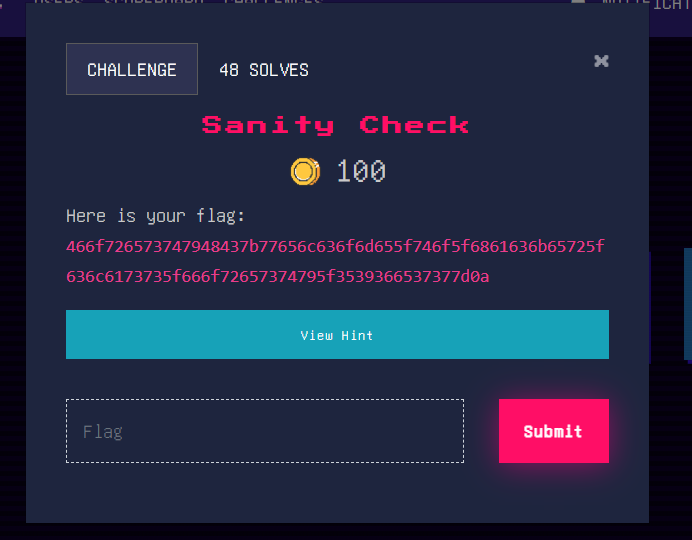

# Sanity Check
###### decode flag
## About the Challenge
Diberikan sebuah flag yang sudah di encode menjadi hex

## Solution
Dikarenakan sudah diketahui bahwa itu merupakan flag yang sudah di encoding menjadi bentuk hex, maka tinggal kita decode saja, bisa menggunakan online tools hex decoder, dan didapat bahwa flag dari challenge adalah
```
ForestyHC{welcome_to_hacker_class_foresty_596e77}
```
